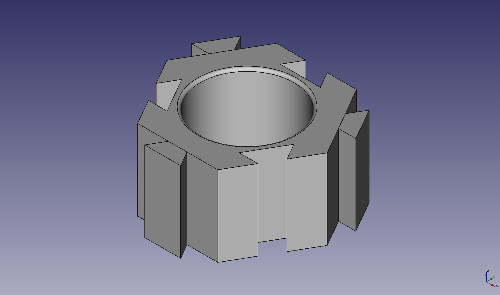
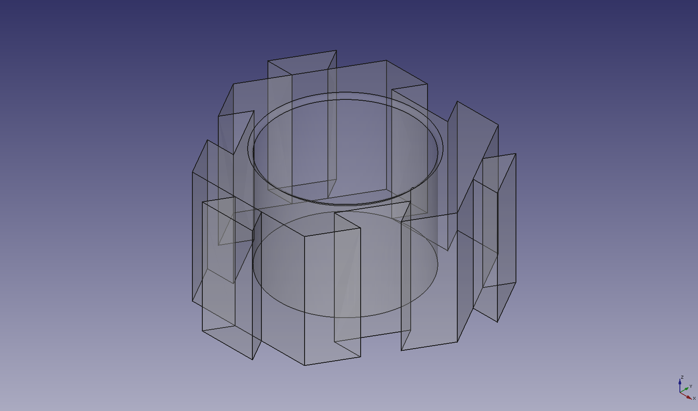
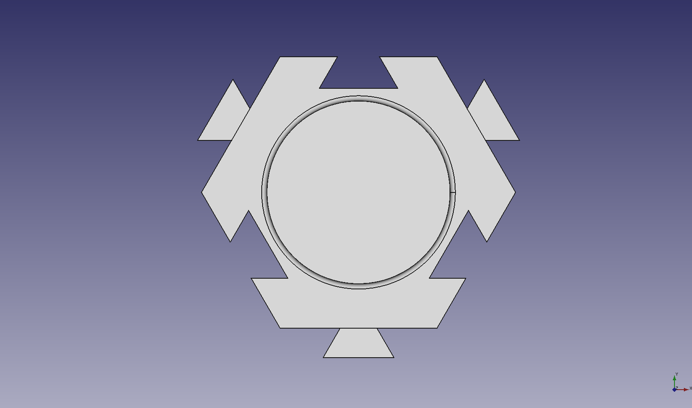
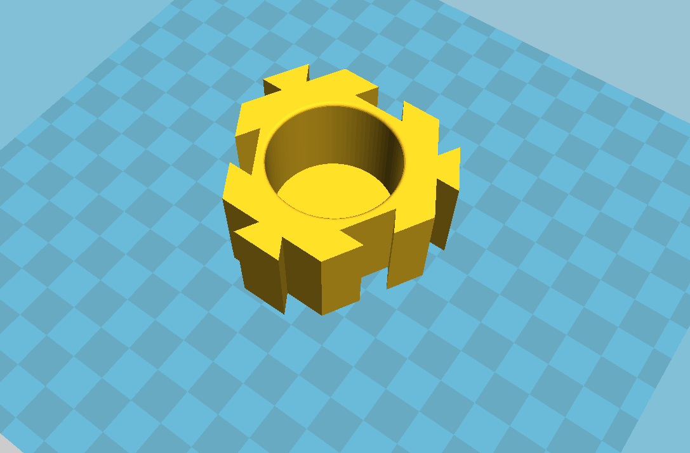
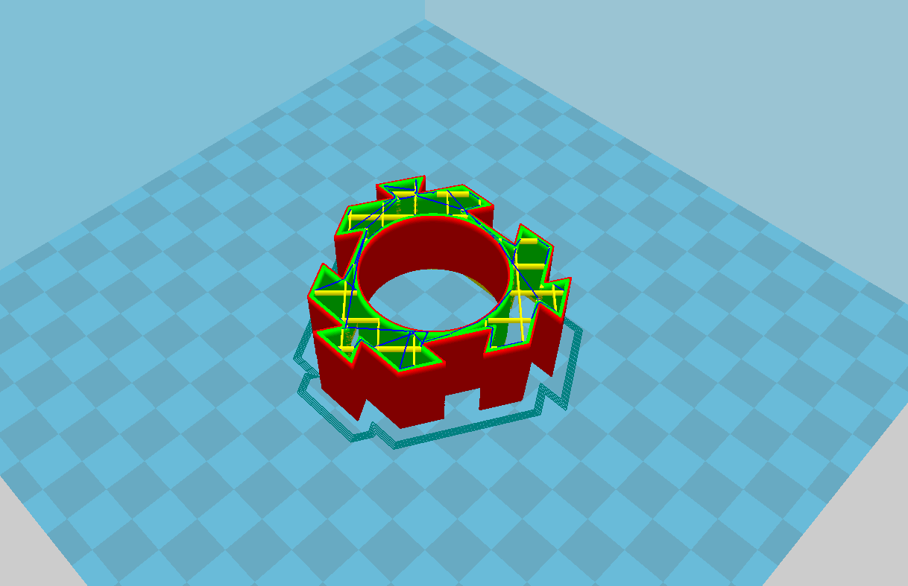
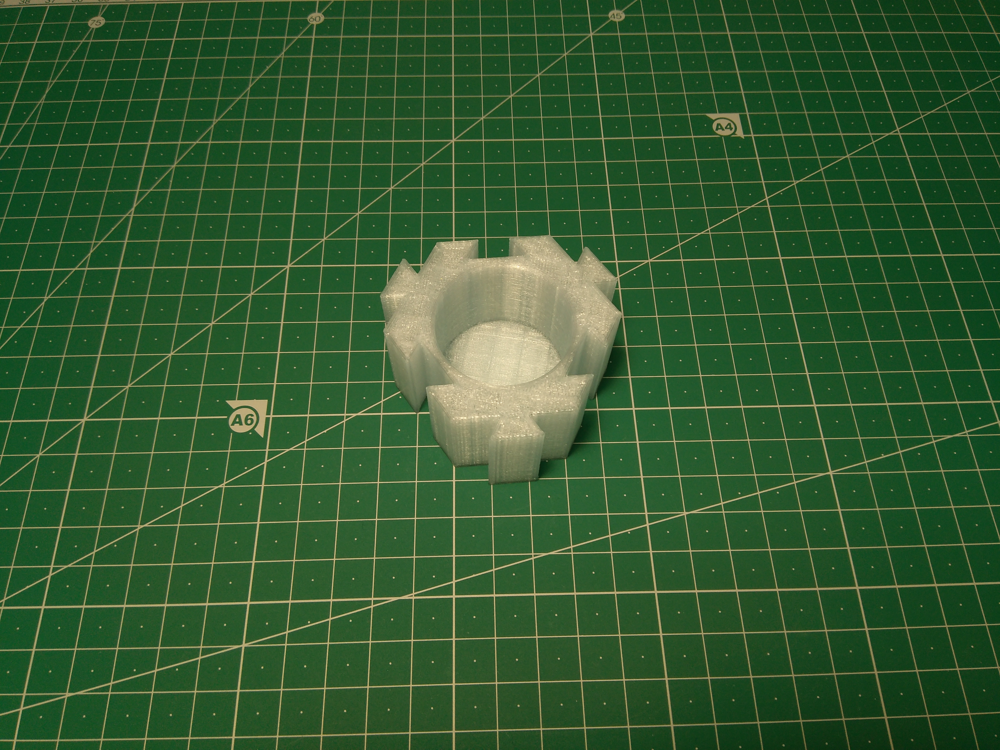
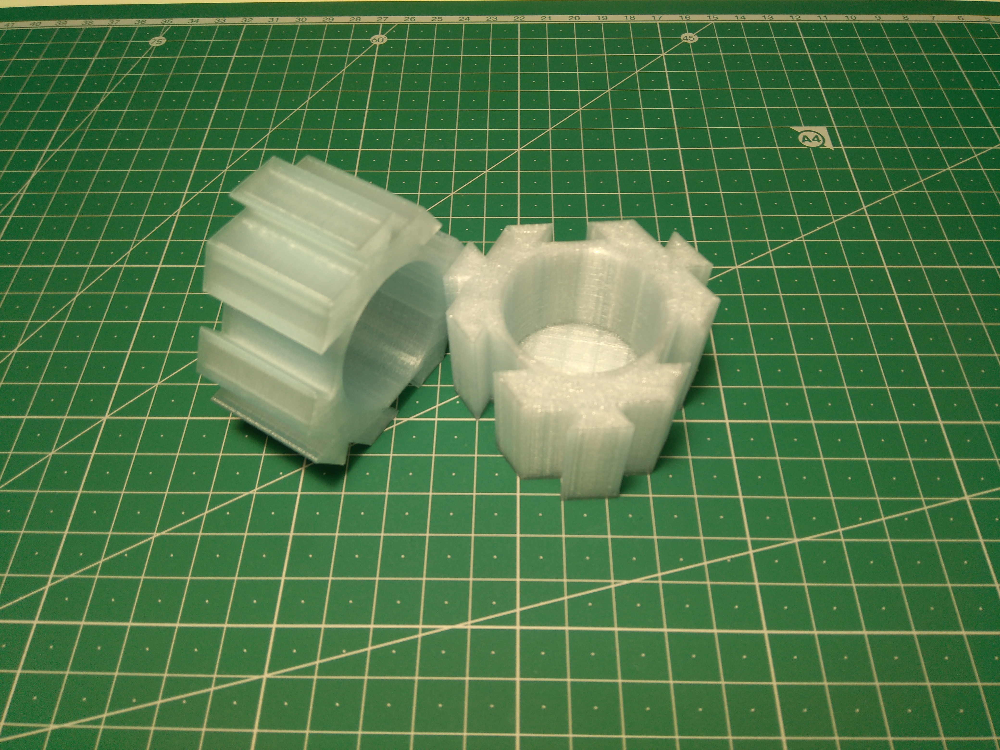
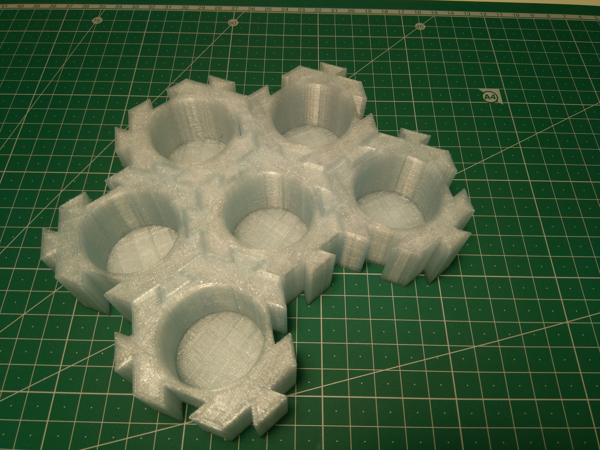
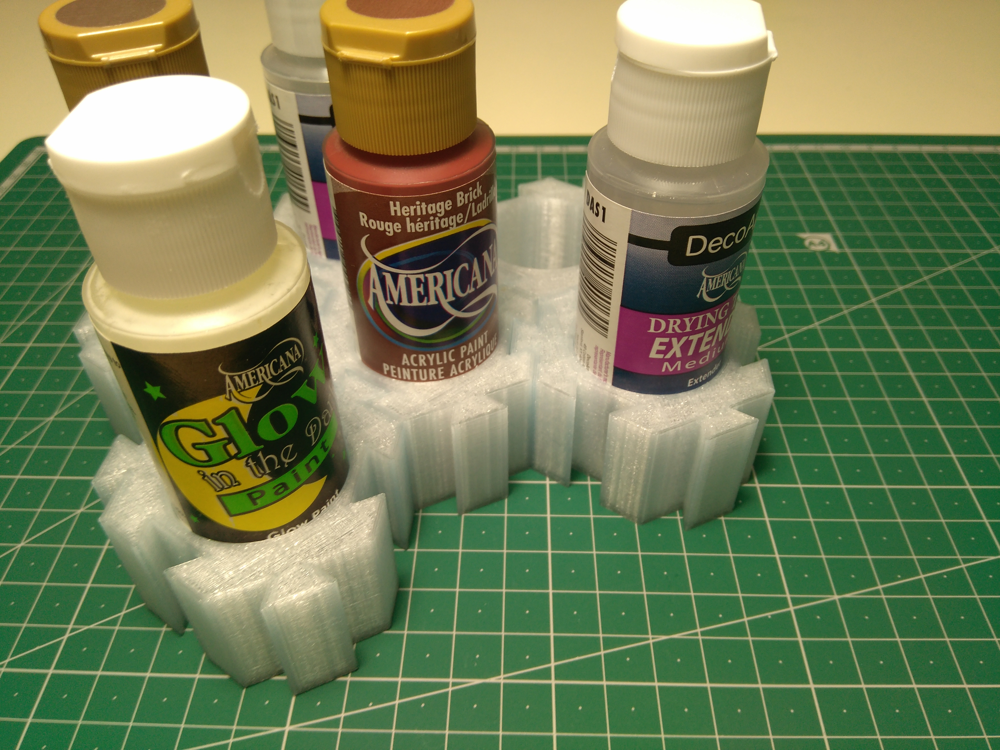

# 3D Printable Hexagon Paint Holders

Diseño en forma de hexágono con interconexión en forma de cola de milano, con hueco para botes de pinturas acrílicas de 59ml/2oz. Botes de 35mm de diámetro.

Está disponible tanto el fichero STL como el fichero original de FreeCAD.

[Fichero STL](./design-files/HexagonPaintHolder.stl)

[Fichero FreeCAD](./design-files/HexagonPaintHolder.fcstd)

---

3D printable paint holders with Hexagon shape, i used tail connections (milano tail), designed for 2oz/59ml acrilyc paint bottles, 35mm diameter.

You can access for the STL file and the original FreeCAD file/design.

[STL File](./design-files/HexagonPaintHolder.stl)

[FreeCAD File](./design-files/HexagonPaintHolder.fcstd)

## Imágenes del Diseño/Design Snapshots

Capturas de pantalla del diseño en FreeCAD y en Cura.

Snapshots of the design from FreeCAD and Cura.

## Fotos/Photos

## LICENCIA/LICENSE

Este diseño y todo el repositorio queda bajo  [Creative Commons Attribution-ShareAlike 4.0 International License](https://creativecommons.org/licenses/by-sa/4.0/deed.es_ES).

Se puede revisar el fichero de licencia para más información.

The design and all repo are under [Creative Commons Attribution-ShareAlike 4.0 International License](http://creativecommons.org/licenses/by-sa/4.0/).

You can see the License file for more information.
